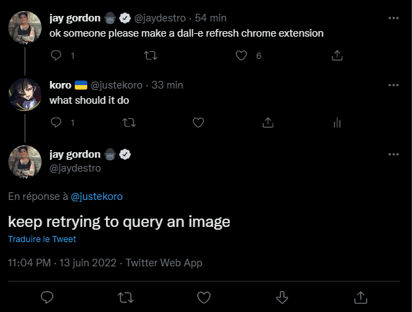

# dalle-autorefresh

----
this just keeps retrying to query an image
# installation
just `git clone` the repo and then follow [this guide](https://webkul.com/blog/how-to-install-the-unpacked-extension-in-chrome/) to install the extension to chrome

[under MIT license](https://opensource.org/licenses/mit-license.php)
